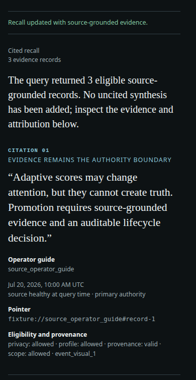
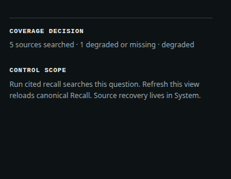
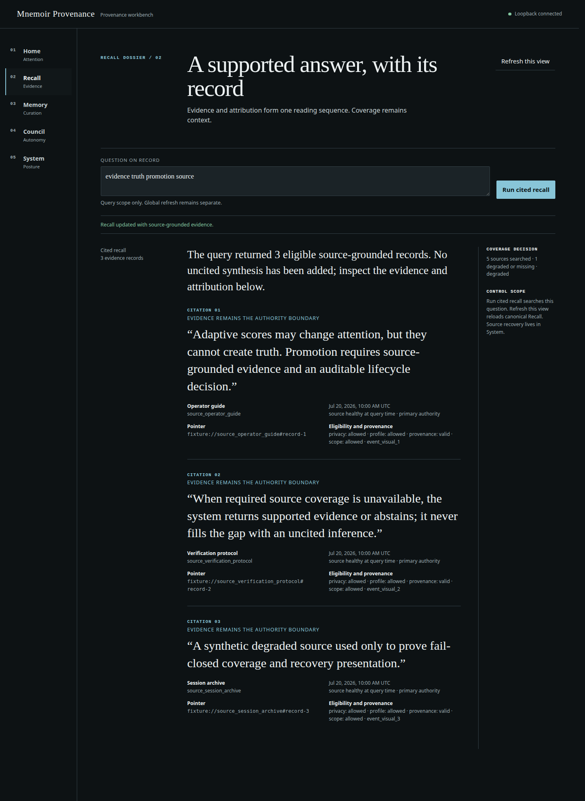
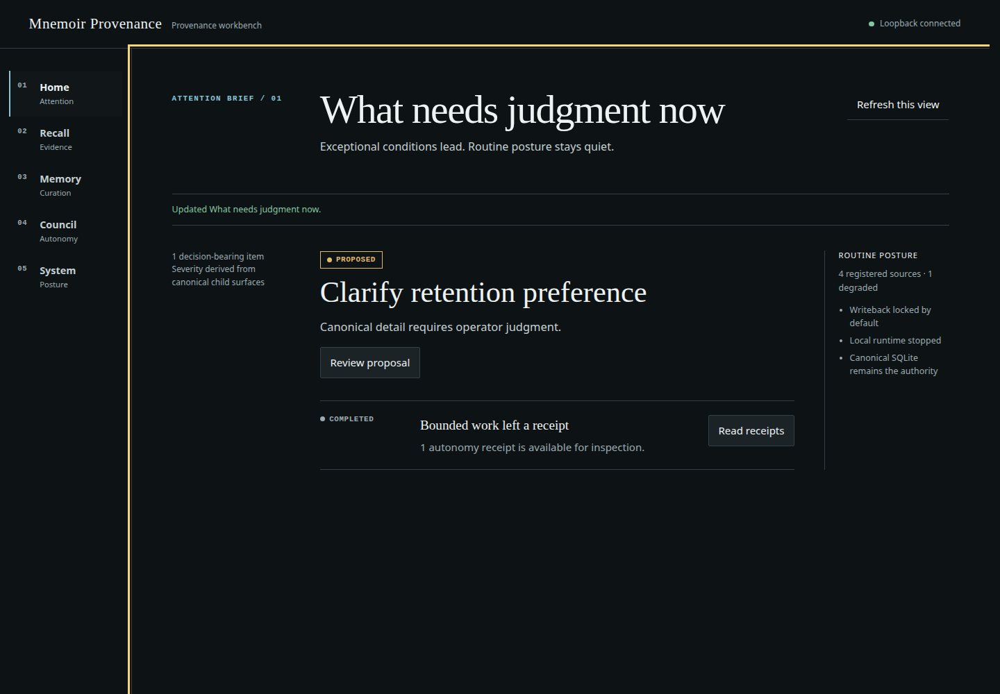

# Mnemoir Provenance

**Agent memory that can show where it came from — and what changed.**

Mnemoir Provenance is a local Python and SQLite memory layer for agents, assistants, and long-running AI systems. It ingests explicitly controlled sources, returns recall with citations and source-coverage status, and keeps durable memory changes behind a reviewable, versioned lifecycle.

When evidence is unavailable, Mnemoir keeps that gap visible instead of quietly substituting an uncited result.

**0.2.0 · Beta · Python 3.11–3.12 supported · MIT · Hermes optional**

- [Quick start](#quick-start)
- [How it works](#from-source-to-recall)
- [Documentation](docs/index.md)

## Memory should not ask you to trust it blindly

Persistent agent memory creates difficult questions:

- Where did this claim come from?
- Which configured sources were unavailable when it was recalled?
- Who or what approved it as durable memory?
- What happened when it was corrected, deactivated, or rolled back?

Mnemoir keeps those questions attached to the record. Recall can include source identity, a safe pointer, a content hash, observation time, and source-coverage status. Observations do not become durable memories automatically. Normal revisions add version history instead of silently overwriting the prior record.

> **Citations expose lineage, not truth.** Mnemoir shows which material supported a result; the operator remains responsible for source authority, correctness, and interpretation.

## What changes with Mnemoir

- **Recall has evidence attached.** Eligible results carry pointers and hashes back to supporting material instead of returning an origin-free memory.
- **Missing sources stay visible.** Responses report which configured sources were searched and which were missing or degraded. A successful result does not conceal impaired coverage.
- **Empty recall stays empty.** No eligible match can produce an abstaining or empty response rather than an uncited fallback. Empty recall is not a claim that something is false.
- **Durable memory is a decision.** Source observations can become proposals; review, approval, writing, read-back, revision, tombstone, and rollback remain separate recorded operations.

## See cited recall

<p align="center">
  
</p>

<p align="center">
  
</p>

*Cited recall keeps the supported statement, source pointer, eligibility, and configured-source coverage together. These width-preserving mobile crops come from the exact installed candidate wheel—not reconstructed UI.*

<details>
<summary><strong>See the complete Recall page and local workbench</strong></summary>





*The local workbench brings decisions that need judgment to the front while keeping routine system posture secondary.*

</details>

*Screenshots use deterministic synthetic records and contain no private profile data. The exact local verification wheel, UI assets, observed browser states, file hashes, and crop coordinates are recorded in the [screenshot manifest](assets/screenshots/manifest.json). No publication was performed.*

## From source to recall

Mnemoir separates records that are often collapsed into one opaque “memory” object:

1. **Observe.** Register a controlled source and ingest source-identified, hashed observations. An observation is not automatically accepted memory.
2. **Recall.** Return eligible evidence with citations, query identity, audit state, and the health of configured sources.
3. **Decide.** Turn supported material into a proposal; record an attributable approval, edit, or rejection. Hosts may impose stricter reviewer policy.
4. **Preserve change.** Write an approved record to canonical SQLite, read it back, and retain application-level history through normal revisions, tombstones, and rollback.

**Canonical boundary:** SQLite remains authoritative. Markdown views are derived, and working-memory changes require a separately authorized adapter.

## Quick start

From a cloned checkout, install the current repository and run the tested in-process example:

```bash
python -m pip install .
python examples/quickstart/python_quickstart.py
```

The example creates disposable synthetic evidence, ingests it, and returns one cited result. Its intentionally unavailable secondary source remains visible as degraded coverage:

```json
{
  "status": "degraded",
  "result_count": 1,
  "cited_results": [{
    "source_pointer": "docs/index.md",
    "content_hash": "a3e93dd7f5708ee4...",
    "snippet": "Synthetic evidence: the project keeps cited local memory."
  }],
  "source_coverage": {
    "coverage_status": "degraded",
    "missing_or_degraded_sources": [{
      "source_id": "local_file_configured_missing",
      "health": "unavailable"
    }]
  }
}
```

Continue with [first source and recall](docs/getting-started/first-source-and-recall.md), [memory lifecycle](docs/getting-started/first-memory-lifecycle.md), or the [CLI reference](docs/reference/cli.md).

## Choose your integration

- **[Python API](docs/guides/integrate-python.md)** — direct in-process control for Python agents and assistants.
- **[JSON CLI](docs/guides/integrate-cli-json.md)** — language-neutral subprocess integration with machine-readable responses and exit codes.
- **[Generic host example](examples/integrations/generic_cli_consumer.py)** — tested proof that the core works without Hermes imports.
- **Local workbench** — run `mnemoir ui` to inspect recall, proposals, approvals, receipts, and system posture over loopback.
- **[Hermes reference adapter](docs/guides/integrate-hermes.md)** — optional profile-scoped context and recall; Hermes is not required by the core.

## Optional capabilities

The primary product is source-grounded recall and controlled memory lifecycle. Advanced operators can add:

- **Retrieval intelligence:** [adaptive scoring](docs/concepts/adaptive-thermal-scoring.md) and offline memory-model experiments that change ordering—not source authority.
- **Coordination:** [multi-actor records](docs/concepts/multi-agent-council-records.md) and [bounded local autonomy](docs/concepts/bounded-autonomy.md) with attributable decisions, budgets, pause/kill controls, and receipts.
- **Operations:** authorized [overflow/writeback](docs/concepts/overflow-trim-and-writeback.md), controlled import from supplied exports, and [derived Markdown/Obsidian views](docs/guides/project-to-obsidian.md) that never replace canonical SQLite.

## Trust boundaries

- **Provenance is not truth.** Citations and hashes identify supporting bytes and lineage; they do not prove correctness, completeness, or authority.
- **Coverage is configured-source coverage.** It does not prove every relevant source was registered, fully ingested, current, or correct.
- **Local does not mean encrypted.** SQLite, imported content, projections, and recovery backups may contain sensitive plaintext. Operators own filesystem permissions, backup policy, retention, and deletion.
- **Hosts still enforce user policy.** Generic local retrieval assumes a trusted operator boundary. Host applications remain responsible for authorization, scope mapping, privacy rendering, and model-facing presentation.
- **Installation starts no runtime.** The package enables no telemetry, daemon, hosted service, or network listener merely by being installed. `mnemoir ui` explicitly starts a loopback listener.
- **Mutation is explicit.** Observations are not promoted automatically, and live working-memory writeback is off until a supported host adapter and durable policy are configured.

Mnemoir is not a truth oracle, a hosted memory API, an implicit private-file crawler, a general autonomous tool executor, encrypted storage, or an operating-system sandbox.

Read [SECURITY.md](SECURITY.md), the [security model](docs/operations/security-model.md), and [privacy and data handling](docs/operations/privacy-and-data-handling.md) before deployment.

## Project status

The repository currently identifies as Mnemoir Provenance 0.2.0 and is classified **Beta**. Python 3.11 and 3.12 are the tested and supported targets. Package metadata permits installation on newer Python 3 versions, but this version makes no support claim beyond 3.12. Linux is the tested and supported candidate environment. The package is MIT licensed.

Mnemoir Provenance is an independent open-source project and is not affiliated with other projects using similar names.

## Documentation

- [Installation](docs/getting-started/installation.md)
- [Mental model](docs/concepts/mental-model.md)
- [Source grounding and provenance](docs/concepts/source-grounding-and-provenance.md)
- [Memory lifecycle and curation](docs/concepts/memory-lifecycle-and-curation.md)
- [Retrieval and context packing](docs/concepts/retrieval-and-context-packing.md)
- [CLI reference](docs/reference/cli.md)
- [Python API reference](docs/reference/python-api.md)
- [Operations](docs/operations/local-deployment.md)
- [Troubleshooting](docs/troubleshooting/index.md)
- [Contributing](CONTRIBUTING.md)

## License

[MIT](LICENSE)
